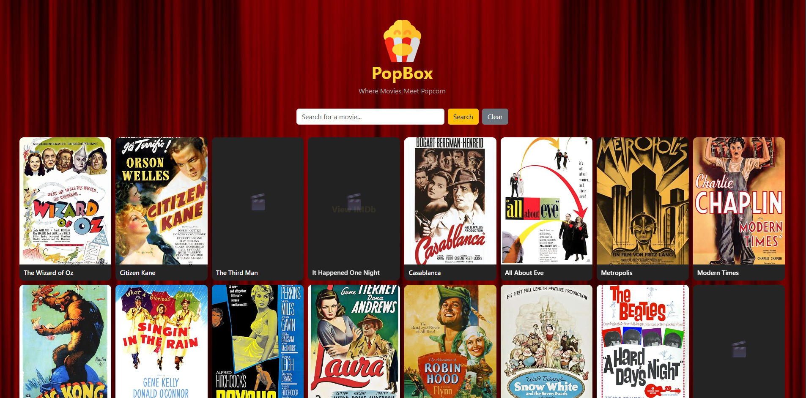

## PopBox
A simple movie search app where users can browse movies, search by title, and view movie details on IMDb.

Image 1: This is the PopBox movie search application.

## Features

- Display movies from an API
- Search movies by title
- Clear search
- Pagination
- Fallback when a movie poster fails to load
- View movies on IMDb

## Tech Stack

- React
- Vite
- JavaScript
- Bootstrap
- CSS
- REST API

## API

Movie data is provided by SampleAPIs.